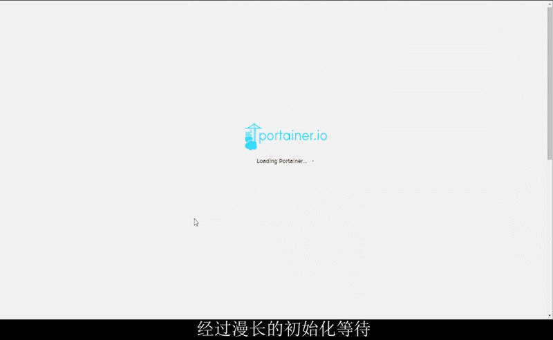
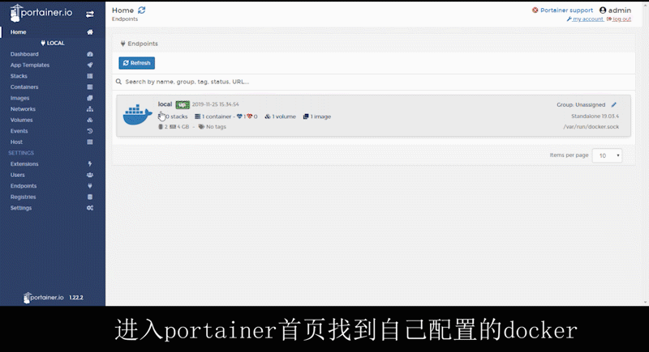

# DevOps系列 - docker的基础应用
## 前言
这里不详细介绍docker的各种详细内容,只说明需要用到的部分

如果你不太了解docker,建议看一遍 [<Docker — 从入门到实践>](https://yeasy.gitbooks.io/docker_practice/content/),这个是我用来学习docker的,详细内容基本都有如只想了解本文章内容,也可以不看(但还是建议看,花不了多少时间,粗略学习花个一两天就差不多了)

本文章属于 [<DevOps - 从入门到出门>](https://github.com/meislzhua/DevOps)的一部分,属于前置文

## 简单的安装和运行docker
我们采用自动化的安装即可,基本上常用的系统都可以采用以下操作,window除外
```
在测试或开发环境中 Docker 官方为了简化安装流程，提供了一套便捷的安装脚本，CentOS 系统上可以使用这套脚本安装，另外可以通过 --mirror 选项使用国内源进行安装：

$ curl -fsSL get.docker.com -o get-docker.sh
$ sudo sh get-docker.sh --mirror Aliyun
# $ sudo sh get-docker.sh --mirror AzureChinaCloud

执行这个命令后，脚本就会自动的将一切准备工作做好，并且把 Docker CE 的稳定(stable)版本安装在系统中。
---摘自 <Docker — 从入门到实践>
```

安装完毕之后,启动服务
```
sudo systemctl enable docker
sudo systemctl start docker

#测试服务是否启动成功
docker run hello-world
```


 

如果你是国内的环境,建议加个速,这里介绍的是阿里云的加速服务(目前的,不知道以后会不会改)

1. 打开阿里云 → 产品分类 → 开发与运维 → 容器镜像服务 → 管理控制台
2. 点击镜像加速器,复制他给出的命令
3. 执行命令,然后执行`docker info`,查看是否修改成功


如果安装出现其他问题,可以参考 [<Docker — 从入门到实践>](https://yeasy.gitbooks.io/docker_practice/content/install/)

## docker超简略介绍
### 架构
docker基本架构为C/S架构,分客户端和服务端

所以其实在上面安装那步不启动服务,也可以执行docker指令,只不过会提示你失败,因没有启动服务端;因为这个特性,所以我们自己利用服务端的API写一个"图形化界面";这里还会有个问题,就是启动用户不属于你执行指令的用户,而属于服务端所属用户;

### 简化描述基本原理
有三个概念:仓库,镜像,容器, 用一句基本都懂的话概括他们的关系就是

从仓库拉取镜像,再把镜像运行成容器,同一个镜像你可以运行多次,变成互不影响的容器;

容器具隔离性,每个容器之间以及宿主机(就是会你运行docker的机器)的内容(文件,网络,进程等等)会隔离(利用linux的命名空间特性)

## 运行参数介绍
虽然有图形化管理,但是实际上需要以命令的形式运行的时候也是比较多的,所以学习这部分也是非常重要的.这里通过几个有代表性的指令,进行介绍

### 通过启动mysql的指令来学习
更多的mysql启动方式,可以在查看它的[描述](https://hub.docker.com/_/mysql)
```
docker run --name some-mysql -v /my/own/datadir:/var/lib/mysql -e MYSQL_ROOT_PASSWORD=my-secret-pw -d mysql:tag

docker run                           运行某个镜像,如果镜像不存在则尝试先下载
--name some-mysql                    为这个容器指定一个名字;这里指定为 some-mysql,名字不能重复,不指定时会随机一个名字
-v /my/own/datadir:/var/lib/mysql    -v 参数是文件映射,就是用自己的文件夹代替容器内的文件夹;这里用我们自己的/my/own/datadir 代替 容器里面的 /var/lib/mysql,具体还有读写控制,数据卷映射,这里不详细介绍
-e MYSQL_ROOT_PASSWOgRD=my-secret-pw  -e是设置环境变量;这里把环境变量MYSQL_ROOT_PASSWORD设置为my-secret-pw,具体需要什么变量,找到官方的介绍就可以知道了
-d                                   这个指定这个容器在后台运行;如果你在前台运行,然后退出容器,这样就会把容器关闭
mysql:tag                            这个是运行的镜像;如果隐藏所有参数则是docker run mysql; :tag是版本,例如mysql:8.0,如果不加ta,默认为latest版本
```


#### 通过启动portainer的指令来学习
再来多看一个portainer启动方式作为补充,已经在上面说过的,就不再说明了
```
$ docker run -d -p 9000:9000 -p 8000:8000 --name portainer --restart always -v /var/run/docker.sock:/var/run/docker.sock -v /path/on/host/data:/data portainer/portainer

-p  9000:9000      -p 是用来做端口映射的;左边的9000是本地的端口,右边的9000容器端口,映射的本地端口可绑定任意想要,例如 19777:9000也是可以的;默认绑定全部IP,也可指定ip,还有随机绑定,不做详细介绍
--restart always   docker重启时,会重启该容器
```

#### 回头再看mysql的启动
我们可以发现,mysql并没有端口映射,即使启动了,也作用不大;这里我能想到的有两种处理方式

1. 增加参数 -p 3306:3306 用3306端口映射到容器的3306,这样访问自己的3306端口就可以访问了
2. 使用[容器互联](https://yeasy.gitbooks.io/docker_practice/content/network/linking.html);即使外部访问不了,容器之间还是可以互相访问的

## 图形化管理工具
其实图形化和命令都是一样的作用,但是可以省去繁琐的命令,这里我们使用的是Portainer
如果你只是普通的使用,不需要集群的之类的,Portainer就够了,这里通过几个GIF基本可以查看步骤了

### Portainer的安装
首先执行安装容器,并在浏览器打开相应9000端口,在网页进行配置即可
```
docker run -d -p 9000:9000 -p 8000:8000 --name portainer --restart always -v /var/run/docker.sock:/var/run/docker.sock  portainer/portainer
```


#### portainer配置过程
 

#### portainer使用实例:jenkins的安装
 

### 请学习更多命令
虽然说自己操作维护的时候,可以使用图形化界面,不用慢慢敲命令,但是编写脚本的时候,还是需要编写命令的!

[命令大全](https://www.runoob.com/docker/docker-command-manual.html)很多地方都能找到,所以这里就不重复再写一遍

这里简单列出一些必须要学会的命令,请务必学习,没列出来的不代表不重要,也都请看一下

| 命令        | 简介           |
| ------------- |:-------------|
| [docker run](https://www.runoob.com/docker/docker-run-command.html)      | 创建容器,重点!重点!重点! | 
| [docker start/stop/restart](https://www.runoob.com/docker/docker-start-stop-restart-command.html)     | 启动,停止,重启容器      | 
| [docker rm](https://www.runoob.com/docker/docker-rm-command.html)     | 移除容器      | 
| [docker exec](https://www.runoob.com/docker/docker-exec-command.html) | 在运行的容器中执行命令,例如执行bash,这样就可以进入容器的命令行      |   
| [docker ps](https://www.runoob.com/docker/docker-ps-command.html) | 列出容器     |   
| [docker cp](https://www.runoob.com/docker/docker-cp-command.html) | 用于容器与主机之间的数据拷贝     |   

## 后语
学习到这里,其实基本上docker的日常用法学习得差不多了,只是还少了Dockerfile,集群,和相关的应用没提及到

Dockerfile和私有仓库,会在之后会提到